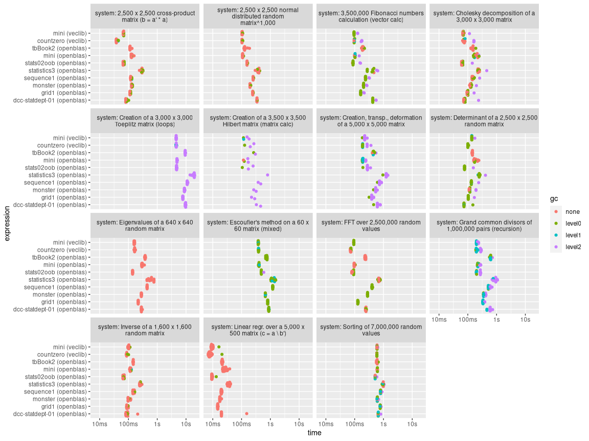
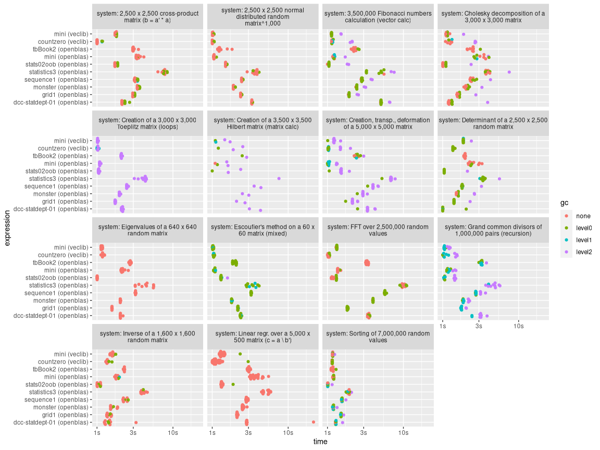

## VM and related machine benchmarks

| Machine         | OS    | Chassis        | CPU             | Cores             | Memory     |
|:----------------|:------|:---------------|:----------------|:------------------|:-----------|
| tbBook2         | MacOS | MacBook Pro 13 | Intel i7        | 4 @ 2.7 GHz       | 16 GB      |
| mini            | MacOS | Mac Mini       | M1              | 8 (4/4)           | 8 GB       |
| countzero       | MacOS | MacBook Pro 14 | M1 Max.         | 10 (8/2)          | 64 GB      |
| monster         | Linux | Dept Server    | Xeon E5-2643 v4 | 6 @ 3.40GHz       | 256 GB     |
| statistics3     | Linux | Old VM         | Xeon E5-2699 v4 | 16 @ 2.20GHz      | 256 GB     |
| sequence1       | Linux | New VM         | Xeon Gold 6252  | 24 @ 2.10GHz      | 256 GB     |
| dcc-statdept-01 | Linux | DCC Node       | Xeon Gold 6154  | 70 (8) @ 3.00GHz  | 724 (2) GB |
| grid1           | Linux | Math grid node | Ryzen 9 5950X   | 16(32) @ 3.4(4.9) | 128 GB     |
| stats02oob      | Linux | New Server     | Ryzen 9 7950X   | 16(32) @ 3.0(5.7) | 128 GB     |

### benchmarkme results

Results are from a modified version of the `benchmarkme` test suite,
they now use the `bench` package with 10 runs each. Less than 10 timing
results are available for some tests due to GC invalidating the test.

The following tests are included: \* 3,500,000 Fibonacci numbers
calculation (vector calc) \* Creation of a 3,500 x 3,500 Hilbert matrix
(matrix cal \* Grand common divisors of 1,000,000 pairs (recursion) \*
Creation of a 3,000 x 3,000 Toeplitz matrix (loops) \* Escoufier’s
method on a 60 x 60 matrix (mixed) \* Creation, transp., deformation of
a 5,000 x 5,000 matrix \* 2,500 x 2,500 normal distributed random
matrix^1,000 \* Sorting of 7,000,000 random values \* 2,500 x 2,500
cross-product matrix (b = a’ \* a) \* Linear regr. over a 5,000 x 500
matrix (c = a \\ b’) \* FFT over 2,500,000 random values \* Eigenvalues
of a 640 x 640 random matrix \* Determinant of a 2,500 x 2,500 random
matrix \* Cholesky decomposition of a 3,000 x 3,000 matrix \* Inverse of
a 1,600 x 1,600 random matrix

#### Preliminary results

#### Preliminary relative results

#### Notes

- For the Mac OS machines the results come from running R linked to
  either OpenBLAS or Apple’s veclib

- Any machine using OpenBLAS was restricted to using a maximum of 4
  threads for BLAS calculations
